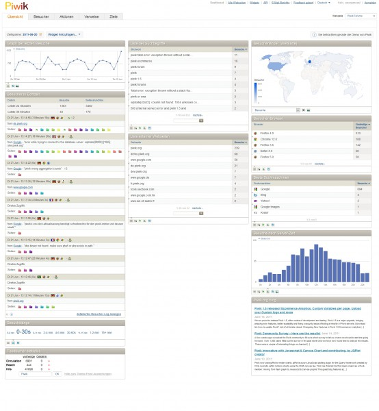
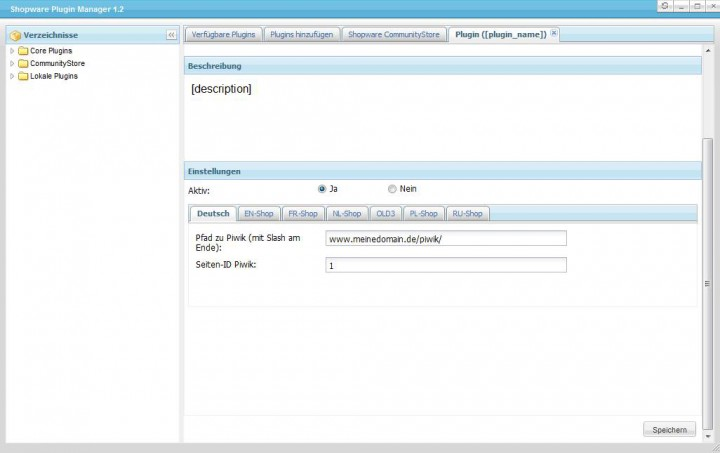

# SwagPiwik

## Supported versions
Shopware version 4.1.0 or higher

## Description
Use this plugin to seamlessly connect your shop to Piwik, the powerful open source analytics software.
Piwik is an open source (GPL licensed) web analytics software that can be downloaded for free.
Piwik provides you with detailed real-time reports concerning your visitors, including
the search engines used, languages preferences, which sites are most popular and much more.

**The plugin offers the following:**

* General tracking statistics (hits / visitors, etc.)
* Records of customer orders (incl. item number, name and total order amount)
* Evaluation of shopping carts
* Records of detail pages and categories

Learn more about the advantages of using Piwik here: [Piwik homepage](http://piwik.org/)
There are additional fees associated with using the services of Piwik. For more information please contact the provider.

## Images

## License

The MIT License (MIT). Please see [License File](LICENSE) for more information.
